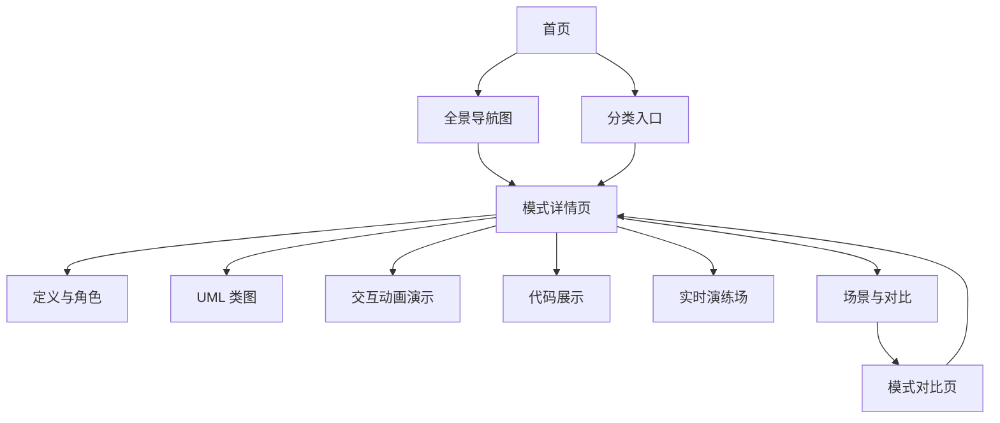

## 1. 产品概述

GoF 23 种设计模式交互式学习平台，基于 Vue 3 构建的静态网站。通过可视化图表、交互动画、代码对比和实时演练，将抽象的设计模式概念转化为直观可理解的学习体验。目标用户为软件开发者和计算机专业学生。

- 解决设计模式学习门槛高、概念抽象难懂的问题
- 通过交互式可视化让用户"看懂"设计模式，而非仅"读过"

## 2. 核心功能

### 2.1 功能模块

1. **首页（总览）**：设计模式全景导航、三大分类入口、学习路径推荐
2. **分类页**：创建型/结构型/行为型模式列表，卡片式展示
3. **模式详情页**：核心讲解页面，包含以下子模块
4. **模式对比页**：相似模式横向对比

### 2.2 页面详情

| 页面名称 | 模块名称 | 功能描述 |
|---------|---------|---------|
| 首页 | 全景导航图 | 交互式思维导图，展示 23 种模式的关系网络，点击可跳转 |
| 首页 | 三大分类入口 | 创建型(5)/结构型(7)/行为型(11) 三大分类卡片，含模式数量和简介 |
| 首页 | 学习路径 | 推荐学习顺序，从易到难，标注前置知识 |
| 首页 | 设计原则速查 | SOLID 等七大设计原则的简要说明和对应模式 |
| 分类页 | 模式卡片列表 | 每个模式一张卡片：名称、一句话定义、难度星级、标签 |
| 分类页 | 筛选与搜索 | 按难度/标签/关键词筛选模式 |
| 模式详情页 | 模式定义 | 模式名称、GoF 定义、一句话通俗解释 |
| 模式详情页 | UML 类图 | Mermaid 渲染的交互式类图，点击类可高亮关联关系 |
| 模式详情页 | 角色说明 | 核心角色卡片：抽象/具体角色，配图标和职责说明 |
| 模式详情页 | 交互式动画演示 | 步进式动画，展示模式运行时对象间的交互流程，用户可控制播放 |
| 模式详情页 | 代码展示 | C# 原始代码 + TypeScript 等价实现，语法高亮，可切换语言 |
| 模式详情页 | 实时演练场 | 内嵌代码编辑器，用户可修改参数运行代码看输出 |
| 模式详情页 | 适用场景 | 3-5 个真实应用场景，配图标和简述 |
| 模式详情页 | 优缺点分析 | 优点/缺点对比列表，配直观图标 |
| 模式详情页 | 与其他模式对比 | 相似模式对比表，说明异同 |
| 模式详情页 | 真实框架应用 | 该模式在 Spring/Vue/React 等框架中的实际应用举例 |
| 模式对比页 | 对比矩阵 | 选择 2-3 个模式进行横向对比：意图、结构、场景、代码 |
| 模式对比页 | 关系图谱 | 模式间关系图：互补、替代、组合等 |

## 3. 核心流程

用户进入首页 → 浏览全景导航或选择分类 → 进入模式详情页 → 依次阅读定义、查看 UML 图、观看交互动画、阅读代码 → 在演练场动手实践 → 查看相似模式对比 → 继续学习下一个模式

## 4. 用户界面设计

### 4.1 设计风格

- **主色调**：深蓝 (#1a1b2e) + 亮青 (#00d4aa) 科技感配色，暗色主题为主
- **辅助色**：暖橙 (#ff6b35) 用于强调和交互提示
- **字体**：标题使用 "Outfit"（几何感、现代），正文使用 "Noto Sans SC"（中文友好）
- **布局风格**：左侧固定导航 + 右侧内容区，卡片式模块布局
- **图标风格**：线性图标 (Lucide)，配几何装饰元素
- **整体风格**：蓝图/技术图纸风格，网格背景，节点连线装饰，呼应"设计模式"的工程感

### 4.2 页面设计概览

| 页面名称 | 模块名称 | UI 元素 |
|---------|---------|---------|
| 首页 | 全景导航图 | Canvas 绘制的节点关系图，节点可拖拽、点击，连线有流动动画 |
| 首页 | 分类入口 | 三张渐变卡片，悬停时浮起+发光效果 |
| 分类页 | 模式卡片 | 深色卡片+左侧色条标识分类，悬停展开简介 |
| 详情页 | UML 类图 | Mermaid 渲染，深色主题，类节点可点击高亮 |
| 详情页 | 交互动画 | 步进控制器（上一步/播放/下一步），对象用圆形/方形表示，连线带箭头动画 |
| 详情页 | 代码展示 | 深色代码块，顶部语言切换 Tab，行号+语法高亮 |
| 详情页 | 演练场 | 左侧代码编辑区 + 右侧输出控制台，运行按钮 |

### 4.3 响应式设计

- 桌面优先，最小宽度 1024px 完整体验
- 平板端：导航折叠为汉堡菜单，内容区单列
- 移动端：简化动画，代码块横向滚动，演练场上下布局

## 5. 讲透设计模式的核心策略

### 5.1 三层递进法

每个模式按 **概念层 → 结构层 → 行为层** 递进讲解：

1. **概念层**：一句话定义 + 生活类比（如：代理模式 = 助理代签）
2. **结构层**：UML 类图 + 角色卡片，看清"谁是谁"
3. **行为层**：交互动画 + 代码，理解"怎么跑起来的"

### 5.2 交互式动画演示（核心亮点）

为每个模式设计一个**步进式动画**，用几何图形表示对象，用连线表示关系，用箭头动画表示调用流：

- **策略模式**：切换折扣策略时，箭头从 Context 指向不同 Strategy 实现
- **观察者模式**：Subject 发出通知，多个 Observer 依次亮起
- **装饰模式**：层层包裹动画，每加一层装饰器外圈扩大
- **责任链模式**：请求沿链条传递，每个节点判断是否处理

用户可控制：上一步 / 播放 / 暂停 / 下一步 / 重置

### 5.3 双语言代码对照

展示 C# 原始代码 + TypeScript 等价实现，帮助前端开发者理解模式在前端中的应用。

### 5.4 模式关系网络

首页的交互式思维导图展示模式间关系：
- **互补关系**：策略 + 工厂方法
- **替代关系**：装饰 vs 代理
- **组合关系**：组合 + 访问者

### 5.5 真实框架映射

每个模式标注在知名框架中的实际应用：
- 观察者模式 → Vue 的响应式系统、EventEmitter
- 策略模式 → 表单验证策略
- 装饰模式 → TypeScript 装饰器、HOC
- 代理模式 → Vue 3 的 reactive/ref
- 单例模式 → Vuex/Pinia Store
