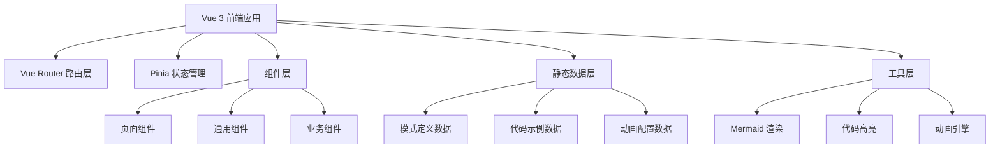

## 1. 架构设计



纯前端静态网站，无后端服务。所有模式数据以 TypeScript 模块形式内嵌，构建时生成静态页面。

## 2. 技术说明

- **前端框架**：Vue 3 + TypeScript + Composition API
- **构建工具**：Vite
- **样式方案**：Tailwind CSS 4
- **路由**：Vue Router 4
- **状态管理**：Pinia（用于动画状态、导航状态等）
- **图表渲染**：Mermaid.js（UML 类图、时序图）
- **代码高亮**：Shiki（支持 C# 和 TypeScript 语法高亮）
- **动画方案**：CSS Animation + Vue Transition + 自定义步进动画引擎
- **初始化工具**：vite-init (vue-ts 模板)

## 3. 路由定义

| 路由 | 用途 |
|------|------|
| `/` | 首页：全景导航、分类入口、学习路径 |
| `/creational` | 创建型模式列表页 |
| `/structural` | 结构型模式列表页 |
| `/behavioral` | 行为型模式列表页 |
| `/pattern/:id` | 模式详情页（核心页面） |
| `/compare` | 模式对比页 |

## 4. 项目结构

```
src/
├── assets/                  # 静态资源
│   └── styles/              # 全局样式
├── components/              # 通用组件
│   ├── layout/              # 布局组件（Header, Sidebar, Footer）
│   ├── diagram/             # 图表组件（UmlDiagram, SequenceDiagram）
│   ├── code/                # 代码组件（CodeBlock, CodeCompare）
│   ├── animation/           # 动画组件（StepPlayer, PatternAnimator）
│   └── common/              # 通用UI组件（Card, Tag, Badge）
├── composables/             # 组合式函数
│   ├── useAnimation.ts      # 动画控制逻辑
│   ├── usePattern.ts        # 模式数据获取
│   └── useMermaid.ts        # Mermaid 渲染逻辑
├── data/                    # 静态数据
│   ├── patterns/            # 每个模式的详细数据
│   │   ├── singleton.ts
│   │   ├── factory-method.ts
│   │   ├── observer.ts
│   │   └── ...              # 23 个模式数据文件
│   ├── categories.ts        # 分类数据
│   └── relations.ts         # 模式关系数据
├── pages/                   # 页面组件
│   ├── HomePage.vue
│   ├── CategoryPage.vue
│   ├── PatternDetailPage.vue
│   └── ComparePage.vue
├── router/                  # 路由配置
│   └── index.ts
├── stores/                  # Pinia 状态
│   ├── navigation.ts        # 导航状态
│   └── animation.ts         # 动画播放状态
├── types/                   # TypeScript 类型定义
│   └── pattern.ts           # 模式相关类型
├── App.vue
└── main.ts
```

## 5. 数据模型

### 5.1 模式数据结构

```typescript
// 模式核心类型定义
interface Pattern {
  id: string                    // 唯一标识，如 'singleton'
  name: string                  // 中文名，如 '单例模式'
  nameEn: string                // 英文名，如 'Singleton Pattern'
  category: 'creational' | 'structural' | 'behavioral'
  difficulty: 1 | 2 | 3        // 难度星级
  tags: string[]                // 标签，如 ['创建型', '线程安全']
  definition: string            // GoF 定义
  simpleExplanation: string     // 一句话通俗解释
  lifeAnalogy: string           // 生活类比

  // 结构层
  roles: PatternRole[]          // 角色列表
  umlCode: string               // Mermaid 类图代码

  // 行为层
  animationSteps: AnimationStep[]  // 动画步骤配置
  scenarios: Scenario[]            // 适用场景

  // 代码层
  codeExamples: CodeExample[]     // 代码示例（多语言）
  pros: string[]                  // 优点
  cons: string[]                  // 缺点

  // 关联层
  relatedPatterns: RelatedPattern[]  // 关联模式
  frameworkExamples: FrameworkExample[]  // 框架应用实例
}

interface PatternRole {
  name: string          // 角色名，如 '抽象策略'
  nameEn: string        // 英文名
  responsibility: string  // 职责说明
  color: string         // 在动画中的颜色标识
}

interface AnimationStep {
  description: string   // 步骤说明
  objects: AnimObject[]  // 动画中的对象状态
  arrows: AnimArrow[]    // 箭头/连线
}

interface CodeExample {
  language: 'csharp' | 'typescript'
  title: string
  code: string
  highlights: number[]   // 高亮行号
}

interface Scenario {
  title: string
  description: string
  icon: string           // Lucide 图标名
}

interface RelatedPattern {
  patternId: string
  relationType: 'complementary' | 'alternative' | 'combinable'
  description: string
}

interface FrameworkExample {
  framework: string      // 如 'Vue 3', 'Spring'
  description: string
  code?: string
}
```

### 5.2 模式 ID 映射

| ID | 中文名 | 英文名 | 分类 |
|----|--------|--------|------|
| singleton | 单例模式 | Singleton | creational |
| factory-method | 工厂方法模式 | Factory Method | creational |
| abstract-factory | 抽象工厂模式 | Abstract Factory | creational |
| builder | 建造者模式 | Builder | creational |
| prototype | 原型模式 | Prototype | creational |
| adapter | 适配器模式 | Adapter | structural |
| bridge | 桥接模式 | Bridge | structural |
| composite | 组合模式 | Composite | structural |
| decorator | 装饰模式 | Decorator | structural |
| facade | 外观模式 | Facade | structural |
| flyweight | 享元模式 | Flyweight | structural |
| proxy | 代理模式 | Proxy | structural |
| strategy | 策略模式 | Strategy | behavioral |
| mediator | 中介者模式 | Mediator | behavioral |
| observer | 观察者模式 | Observer | behavioral |
| command | 命令模式 | Command | behavioral |
| chain-of-responsibility | 责任链模式 | Chain of Responsibility | behavioral |
| state | 状态模式 | State | behavioral |
| template-method | 模板方法模式 | Template Method | behavioral |
| iterator | 迭代器模式 | Iterator | behavioral |
| memento | 备忘录模式 | Memento | behavioral |
| interpreter | 解释器模式 | Interpreter | behavioral |
| visitor | 访问者模式 | Visitor | behavioral |

## 6. 核心技术方案

### 6.1 交互动画引擎

自定义轻量级步进动画引擎，基于 Vue 3 响应式系统：

- 每个模式定义 `AnimationStep[]` 配置
- `StepPlayer` 组件提供播放控制（上一步/播放/暂停/下一步/重置）
- `PatternAnimator` 组件根据当前步骤渲染 SVG 对象和连线
- 利用 Vue 的 `transition` 组件实现步骤间平滑过渡
- 对象使用 SVG 圆形/方形，连线使用 SVG path + CSS 动画箭头

### 6.2 Mermaid UML 渲染

- 使用 `mermaid` 库在客户端渲染类图
- 自定义 Mermaid 主题匹配暗色设计风格
- 通过 `useMermaid` composable 封装渲染逻辑
- 支持点击类节点高亮关联关系

### 6.3 代码高亮方案

- 使用 `shiki` 进行服务端/构建时代码高亮
- 支持 C# 和 TypeScript 双语言切换
- 行号显示 + 关键行高亮

### 6.4 首页全景导航

- 使用 Canvas 绘制模式关系网络图
- 力导向布局算法（简化版 d3-force）
- 节点可拖拽、点击跳转
- 连线有流动粒子动画表示关系方向
